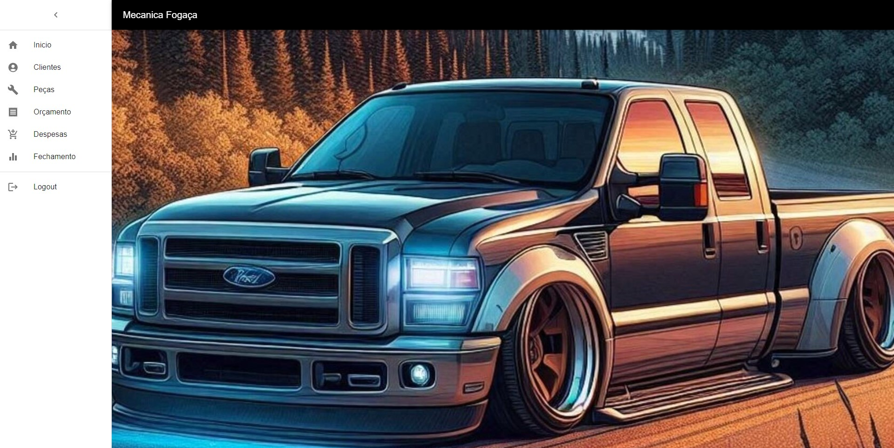
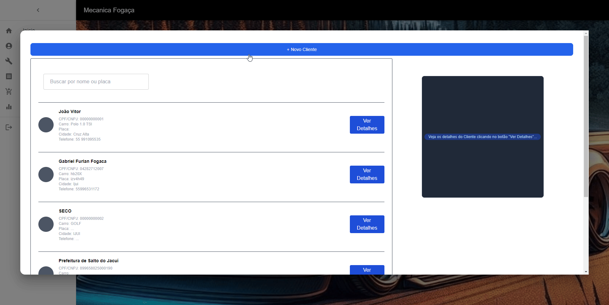

O Website foi desenvolvivo para a Mecanica Fogaça.

Possui as seguintes funcionalidades:
-Cadastro, edição e exclusão de Clientes;
-Cadastro, edição e exclusão de Peças;
-Cadastro, edição e exclusão de Despesas;
-Cadastro, edição e exclusão Orçamentos;
-Fechamento do Mês.

#Inicio:

#Clientes:

#Peças:

#Despesas:

#Orçamentos:

#Fechamento do Mês:

